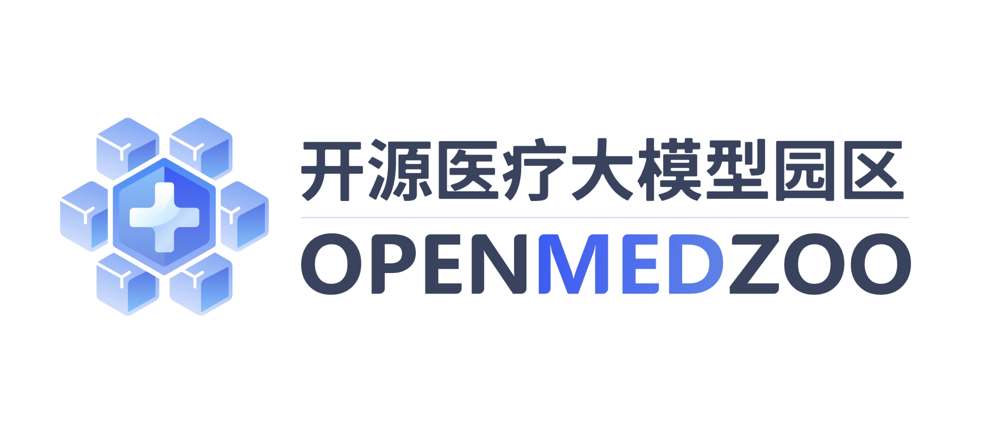

# OpenMedZoo 

   <!-- 建议替换为您设计的Logo SVG -->

  <strong>共建开放、安全、可信的医疗大模型生态</strong>

    
    
    
    

---

欢迎来到 **OpenMedZoo (开源医疗大模型园区)**！我们是一个致力于推动医疗大模型发展的开源社区。模型、算法与数据集将持续更新，敬请关注！

**OpenMedZoo** 旨在构建一个开放、安全、可信的医疗AI生态系统。我们汇集全球顶尖研究力量，分享多模态、多场景的医疗基础模型、算法与数据集，目标是：
- **降低AI医疗研发门槛**，让更多开发者能够参与创新。
- **解决医疗领域的长尾问题**，推动精准医疗的发展。
- **建立安全可信的AI标准**，确保技术向善，服务于人类健康。

我们相信，通过开源协作的范式，能够高效地开发出泛化能力更强、成本更低、更值得信赖的医疗AI解决方案。

## 我们的愿景：开源的核心价值

我们坚信开源是推动医疗AI健康发展的关键动力。其核心价值体现在：

*   **💡 促进创新与协作**：开放模型和代码能够激发全球研究者的创造力，打破机构壁垒，共同解决医疗领域的复杂挑战，加速技术迭代。
*   **🛡️ 提升透明与可信**：开源使得模型的内部机制、训练数据和潜在偏见可被广泛审查，极大地增强了模型的可解释性和可靠性，是构建可信AI的基石。
*   **🚀 加速研究成果转化**：提供强大的预训练基础模型，使开发者能以更低成本、更高效率进行下游任务微调，快速将前沿研究应用于实际临床场景。
*   **🤝 共建安全与伦理标准**：通过社区的集体智慧，共同识别和修复模型的安全漏洞，探讨并建立符合医疗伦理的AI应用规范，为负责任的AI保驾护航。

---

## ⭐ 精选仓库 (Featured Repositories)

| 仓库 (Repository) | 简介 (Description) | Stars |
| :--- | :--- | :---: |
| 🩺 **[MedGO](https://github.com/openmedzoo/MedGO)** | 新一代医学大语言模型，提供精准的知识问答、病历生成与辅助诊断建议。 | `⭐️ 待发布` |
| 🛡️ **[Security-Reasoner](https://github.com/openmedzoo/Security-Reasoner)** | 医疗大模型的“守护者”，用于保障模型输出的安全性、事实性和合规性。 | `⭐️ 待发布` |
---
<!-- 待未来发布的仓库模板
| 📚 **[Awesome-Medical-Datasets-for-LLM]** | 为医疗大模型研究整理的开源数据集集合。 | `⭐️ 待发布` |
| ⚖️ **[MedSafety-Bench]** | 面向医疗大模型的安全性与可靠性评测基准。 | `⭐️ 待发布` |
-->

## 核心模型 (Core Models)

### 🩺 MedGO: 新一代医学大语言模型

**MedGO** 是基于海量医学文献、临床指南和脱敏病历数据训练的医学专用大语言模型。它具备强大的自然语言理解和生成能力，旨在为医生、研究人员和患者提供精准、可靠的智能支持。

- **主要功能**: 医学知识问答、病历摘要与报告生成、辅助诊断建议、临床对话模拟。
- **技术特点**: 知识增强、事实性校准、多轮对话能力。
- **[代码与模型] (https://github.com/openmedzoo/MedGO)**

### 🛡️ 内生安全推理模型 (Endogenous Security Reasoning Model)

作为医疗AI生态的“免疫系统”，该模型专注于保障大模型输出的安全性与合规性。它能够对其他模型（如MedGO）的生成内容进行实时风险评估、事实核查和伦理审查，形成一个“生成-审查”的闭环，确保输出结果安全、可靠、负责任。

- **主要功能**: 风险内容识别（如错误信息、偏见）、事实性核查、医疗合规性检查、可解释性增强。
- **技术特点**: 与主模型解耦、推理过程透明、支持自定义安全规则。
- **[了解安全框架] (https://github.com/openmedzoo/Security-Reasoner)**

---

## 贡献者 (Contributors)

**OpenMedZoo** 的发展离不开以下核心贡献者与合作单位的支持。

*   **项目负责人**: TBD
*   **核心贡献单位**:
    *   TBD大学 人工智能学院
    *   TBD附属医院 信息中心
    *   TBD国家重点实验室
*   **主要贡献者**: TBD

我们欢迎更多对医疗AI充满热情的个人和机构加入我们！

## 联系我们

我们期待与学术界和产业界的同仁进行深入交流与合作。

*   **官方邮箱**: <openmedzoo@pjlab.org.cn>
*   **加入讨论**: (可以链接到 Slack, Discord, 或微信群二维码)

## 友情链接

- **[MedBench](https://medbench.opencompass.org.cn)** -- 一个科学、公平且严谨的中文医疗大模型评测体系及开放平台。
